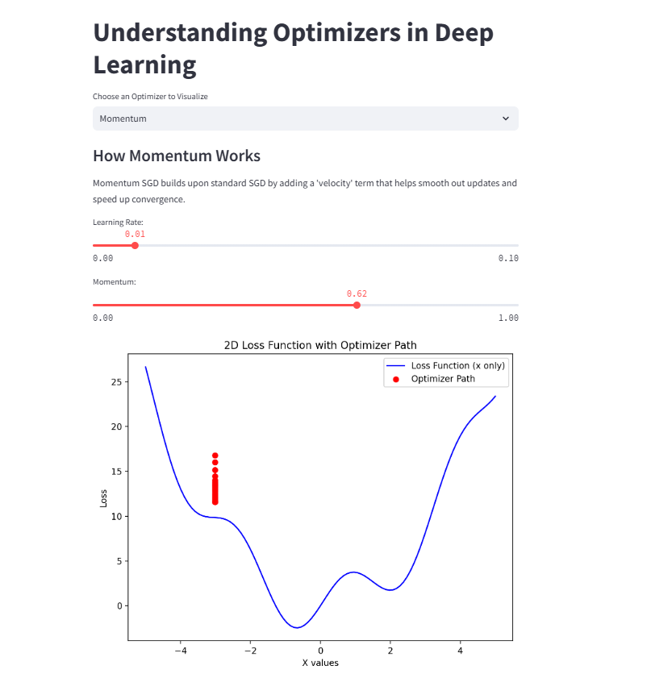
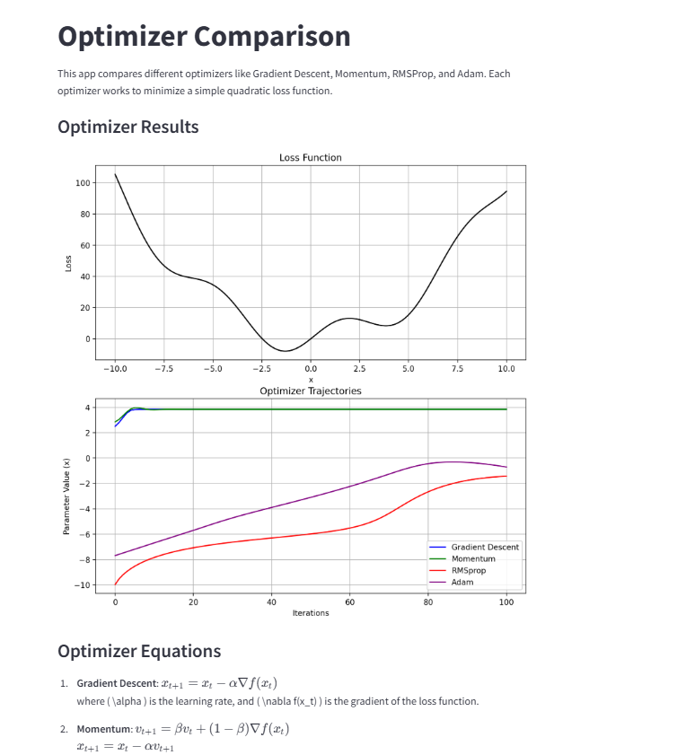
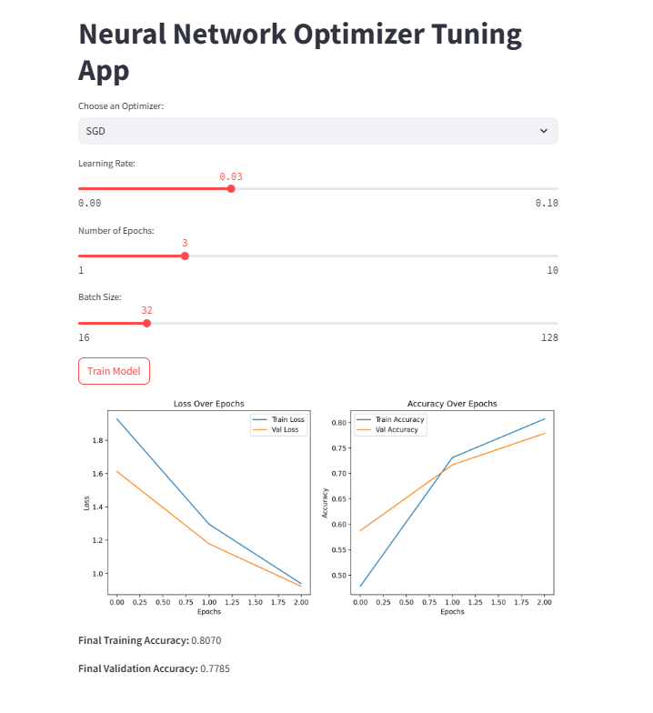
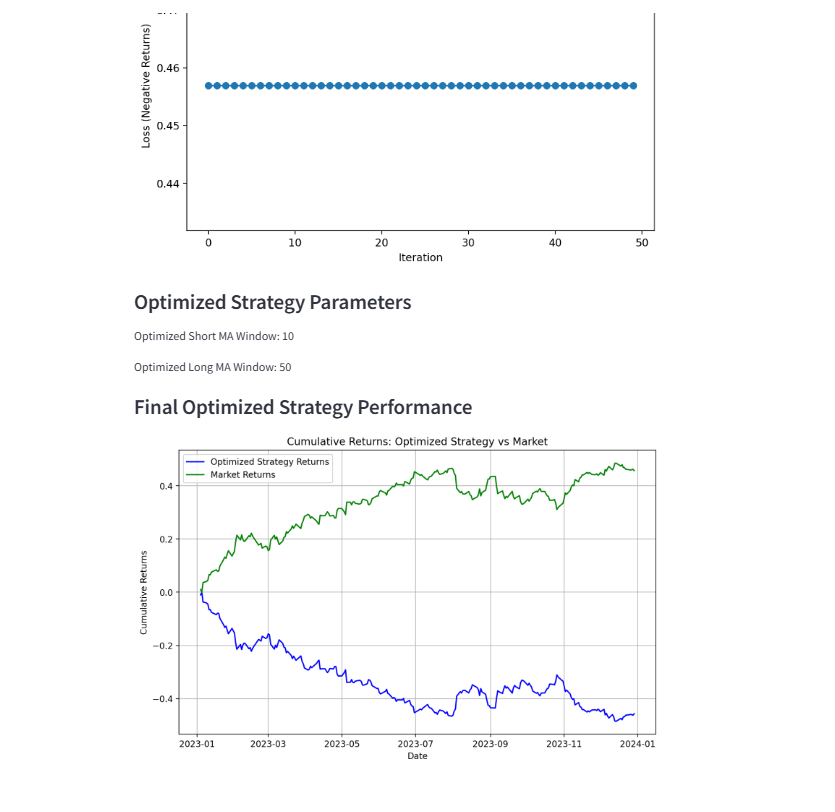

Here’s a `README.md` file that you can use for your GitHub repository to describe the purpose and functionality of the provided files:

---

# Optimization and Trading Strategy Visualization

This repository contains a collection of Python scripts that demonstrate various optimization techniques and their applications in deep learning and trading strategies. The scripts are built using `Streamlit`, `PyTorch`, `TensorFlow`, and other libraries to provide interactive visualizations and comparisons of different optimizers.

## Files Overview

### 1. **`methods.py`**
- **Purpose**: Visualizes the behavior of different optimizers (SGD, Momentum, RMSprop, Adam, Adagrad, Nadam) on a sample quadratic loss function.
- **Features**:
  - Interactive selection of optimizers and hyperparameters.
  - 2D and 3D plots of the loss surface and optimizer trajectories.
  - Explanation of how each optimizer works.

### 2. **`opt2.py`**
- **Purpose**: Compares first-order optimizers (SGD, Adam, RMSprop) with second-order optimizers (LBFGS) on a simple neural network trained on the MNIST dataset.
- **Features**:
  - Interactive selection of optimizers and hyperparameters.
  - Training and comparison of loss curves for first-order and second-order optimizers.
  - Visualization of training progress.

### 3. **`optimization.py`**
- **Purpose**: Demonstrates and compares the performance of different optimizers (Gradient Descent, Momentum, RMSprop, Adam) on a simple quadratic loss function.
- **Features**:
  - Interactive selection of hyperparameters for each optimizer.
  - Visualization of the loss function and optimizer trajectories.
  - Mathematical equations for each optimizer.

### 4. **`tfexam.py`**
- **Purpose**: Tunes and trains a simple neural network on the MNIST dataset using different optimizers (SGD, Momentum, RMSprop, Adam, Adagrad, Nadam).
- **Features**:
  - Interactive selection of optimizers and hyperparameters.
  - Training progress visualization with loss and accuracy plots.
  - Final training and validation accuracy display.

### 5. **`trading.py`**
- **Purpose**: Optimizes a trading strategy (moving average crossover) using different optimizers (SGD, Momentum, RMSprop, Adam, Adagrad, Nadam) on stock data.
- **Features**:
  - Interactive selection of optimizers and hyperparameters.
  - Visualization of stock data and strategy performance.
  - Optimization of strategy parameters and comparison of cumulative returns.

## Requirements

To run these scripts, you need the following Python libraries:

- `streamlit`
- `numpy`
- `matplotlib`
- `torch`
- `tensorflow`
- `yfinance` (for `trading.py`)
- `scikit-learn` (for `opt2.py`)

You can install the required libraries using:

```bash
pip install streamlit numpy matplotlib torch tensorflow yfinance scikit-learn
```

## How to Run

1. Clone the repository:

   ```bash
   git clone https://github.com/your-username/optimization-trading-visualization.git
   cd optimization-trading-visualization
   ```

2. Run the desired script using Streamlit:

   ```bash
   streamlit run methods.py
   streamlit run opt2.py
   streamlit run optimization.py
   streamlit run tfexam.py
   streamlit run trading.py
   ```

3. Open the provided URL in your browser to interact with the app.

## Screenshots

### `methods.py`


### `opt2.py`


### `optimization.py`


### `tfexam.py`


### `trading.py`


## Contributing

Contributions are welcome! If you have any suggestions, bug reports, or feature requests, please open an issue or submit a pull request.

## License

This project is licensed under the MIT License. See the [LICENSE](LICENSE) file for details.

---

This `README.md` provides a clear overview of the repository, its contents, and instructions for running the scripts. You can customize it further based on your specific needs or additional features you might add in the future.
